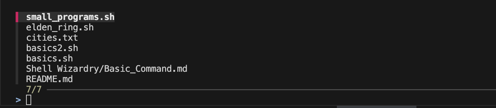

# 🧩 Basic Linux Commands

This document explains some commonly used Linux commands with syntax, examples, and descriptions.

(Manual)

-**Help** → man [command] or tldr [command]
-**Quit the Manual Viewer** → q


## 1. `ls` — List Directory Contents

**Syntax:**
```bash
ls [options] [directory]
```
**Example:**

`ls -lateh ~/ubuntu/`
### Explanation of options

- **`-l`** → long listing format  
- **`-a`** → show hidden files (those starting with `.`)  
- **`-t`** → sort by modification time (newest first)  
- **`-e`** → display file creation time (on supported systems)  
- **`-h`** → human-readable file sizes (e.g., KB, MB)

**Output Example**
```bash
drwxr-xr-x   3 root  wheel    96B 22 Oct 11:03 Volumes
drwxr-xr-x   6 root  wheel   192B 22 Oct 11:03 private
dr-xr-xr-x   4 root  wheel   4.7K 22 Oct 11:02 dev
drwxrwxr-x  21 root  admin   672B 19 Oct 00:03 Applications
```


## 2. `cd` — Change Directory 

**Syntax:**
```bash
cd [directory]
```

### Explanation

- **`cd /home/user/Desktop`** → Moves between directories. 
- **`cd ..`** → show hidden files (those starting with `.`)  
- **`cd ~`** → sort by modification time (newest first) 


## 3. `pwd` — Print Working Directory

**Syntax:**
```bash
pwd
```
**Output Example:**

```bash
/home/username/Documents
```


## 4. `echo` — Print Some Text

**Syntax:**
```bash
echo "Heyy, I am Harshit Joshi"
```

**Output Example**
```bash
Heyy, I am Harshit Joshi
```


## 5. `cat` — Prints the content of the file

**Syntax:**
```bash
cat [options] [filename]
```

### Explanation

- **`cat -b filename.ext`** → Creates a numbered list with non-blank lines
- **`cat -n filename.ext`** → Creates a numbered list with all lines, including blank lines.  
- **`cat test1.txt test2.txt`** → display multiple file 
- **`cat >filename.ext`** →  Create new files, Add text,Exit Ctrl+d
- **`cat test1.txt > test3.txt`** → Redirect Contents of a Single File
- **`cat test1.txt >> test4.txt`** → Append File Contents to Another File
- **`tac test3.txt`** → Display the Contents in Reverse Order


## 6. `touch` — Create Empty Files

**Syntax:**
```bash
touch [filename]
```


## 7. `mkdir` — Create directory

**Syntax:**
```bash
mkdir [options] [directory]
```
**Example:**

`mkdir -p parentDirectory/childDirectory/grandchildDirectory`
### Explanation of options

- **`mkdir {test1,test2,test3}`** → create multiple directories 
- **`mkdir -p, --parents p/c`** → no error if existing, make parent directories as needed 
- **`mkdir -m 700, -m u=rwx p/c`** → set the permission mode 
- **`mkdir -v directoryname`** → feedback for successful operations


## 8. `cp` — Copy File or Directory to Target Destination

**Syntax:**
```bash
cp [options] [directory] [new directory]
cp [options] [filename] [new filename]
```
**Example:**

`cp -r ~/ubuntu/build  /var/html/www`
### Explanation of options

- **`-r, --recursive`** → recursively copies directories and their contents
- **`-i, --interactive`** → prompt to the standard error output before overwriting
- **`-p, --preserve`** → preserves the mode, ownership, and timestamps 
- **`-f, --force`** →  overwrite of destination files without prompting
- **`-b, --backup`** → backup of each existing destination file before overwriting
- **`-v, --verbose`** → shows which files are being copied in detail


## 9. `mv` — move files

**Syntax:**
```bash
mv [options] [directory] [new directory]
mv [options] [filename] [new filename]
```
**Example:**

`mv -r ~/ubuntu/build  /var/html/www`


## 10. `rm` — Remove Directory Entries

**Syntax:**
```bash
rm [options] [directory]
```
**Example:**

`rm -rf folder`
### Explanation of options

- **`-r`** → remove the file hierarchy recursively 
- **`-x`** → when removing a hierarchy, do not cross mount points  
- **`-i`** → request confirmation before attempting to remove each file  
- **`-f`** → remove the files without prompting for confirmation  
- **`-d`** → remove directories as well as other types of files


## 11. `ln` — Create a symlink

>useful for maintaining multiple copies of a file in many places at once without using up storage for the “copies”. There are two types of links; hard links and symbolic links.

> Hard Links: Can Point to files only And Point to files in same Partition


**Syntax:**
```bash
ln [options] [full source file] [full target directory]
```
**Example:**

`ln -s cities.txt lnknewcities.txt`

### Explanation of options

- **`-s`** → creating symbiotic link 
- **`-F`** → remove can existing target file or directory so that the link may occur 
- **`-L, --logical`** → dereference TARGETs that are symbolic links 
- **`-P, --physical`** → make hard links directly to symbolic links
- **`-f`** → remove existing destination files
- **`-h`** → target_file or target_dir is a symbolic link, do not follow it
- **`-b`** → backup

**Output Example**
```bash
lrwxr-xr-x@ 1 ashishsaini  staff    10 Oct 24 02:09 lnknewcities.txt -> cities.txt
```

## 12. `more & less & most` — File Pagers 

> `more`(old): forward navigation and limited backward navigation.

> `less`(new): forward and backward navigation and also has search options. You can go to the beginning and the end of a file instantly


**Syntax:**
```bash
more [filename]
less [filename]
```
**Example:**

`less -N file.txt`

### Explanation of options

- **`-N`** → Display line numbers. 
- **`-i`** → Ignore case during search operations
- **`-S, --chop-long-lines`** → Chop long lines instead of wrapping them

### Explanation of commands 

- **`f or spacebar`** →  move forward one page
- **`b`** →  move backward one page
- **`Down arrow`** → scroll down one line
- **`Up arrow`** → scroll up one line
- **`/pattern`** → search forward for a specific pattern
- **`?pattern`** → search backward for a specific pattern
- **`n`** → go to the next match
- **`N`** → go to the previous match
- **`g`** →  go to the beginning of the file  
- **`G`** →  go to the end of the file
- **`q`** → quit 

## 13. `grep` — Global Regular Expression Print

> The pattern you are searching for

**Syntax:**
```bash
grep '[search_pattern]' [file_name]
```
**Example:**

`grep 'cloud computing' example_file2.txt`

### Explanation of options

- **`-i`** → search ignores case 
- **`-w`** → match only whole words  
- **`-r, -R`** → search through subdirectories for the pattern
- **`-x`** → match only whole lines  
- **`-l`** → list files with the matching pattern only once
- **`-a`** → search binary files
- **`grep 'ransomware' *`** → search all files in directory

## 14. `rg` — ripgrep

> powerful and fast command-line search tool designed for recursively searching directories for a regex pattern

**Syntax:**
```bash
grep '[search_pattern]' [file_name/directory]
```

## 15. `find` OR `fd` — search for files in a directory hierarchy

**Syntax:**
```bash
find [options] [directory] -type d
fd [OPTION] [PATTERN] [PATH]
```

**Example:**

`find "node_modules" -type d `
`fd -H .git` 

### Explanation of commands and 

- **`fd -H .git`** → hidden files and directories
- **`fd -I, --no-ignore`** →  Do not respect hidden files
- **`fd -i`** → case insensitive
- **`fd -s`** → case sensitive
- **`fd -e`** → filter by file extension
- **`fd -t [f,d,l,x,e]`** → Filter by file type.


## 16. `head` AND `tail`  — Display First & Last Lines of a File

**Syntax:**
```bash
head [options] [filename]
tail [options] [filename]
```
**Example:**

`head -n 50 filename.ext`
`less -n 50 filename.ext`
### Explanation of options

- **`-n`** → print count lines of each of the specified files
- **`-c`** → print bytes of each of the specified files
- **`-f`** → follow the new lines


## 17. `sed` — Stream Editor

> Powerful stream editor used for parsing and transforming text. It reads input line by line, applies a series of editing commands, and then outputs the modified lines

**Syntax:**
```bash
sed [] [filename]
```
**Example:**

`sed 's/old_string/new_string/g' filename.txt`
### Explanation of options

- **`s/`** → indicates a substitute command  
- **`/g`** → replaces all occurrences
- **`sed '/pattern_to_delete/d' filename.txt`**
- **`sed '/pattern/i\This is a new line.' filename.txt`** → Appends a line 
- **`sed '/pattern/i\This is a new line.' filename.txt`** → Inserts a line
- **`sed -n '5p' filename.txt`** → Prints the 5th line
- **`  sed -n '1,10p' filename.txt`** → Prints lines 1 to 10

## 18. `|` — Pipe Operator (Postfix delivery to external command)

**Syntax:**
```bash
command1 | command2 | command3
```
**Example:**

`ls -l | grep "txt"`

### Explanation of options

- **`echo 'Hello, world!' | sed 's/world/universe/g' `** → Hello, universe!


## 19. `$()` — Sub Shell

**Syntax:**
```bash
$([command] | [command])
```
**Example:**
`echo "My current directory is: $(pwd)"`

## 20. `>` — Redirection

**Syntax:**
```bash
[command] > [output filename]
```
**Example:**
`ls --help > ls-help.txt`

## 21. `>>` — Append

**Syntax:**
```bash
[command] >> [output filename]
```
**Example:**
`echo 'hello doc file' >> ls-help.txt`

## 22. `<` — Redirection

**Syntax:**
```bash
[command] < [input filename]
```
**Example:**
`wc -l < my_data.txt` → which counts lines

## 23. `fzf` — Fuzzy Finding

> Starts searching a list of file paths under the current directory

**Syntax:**
```bash
fzf [option] [command]
```

**Example:**
`find * -type f | fzf` 

**Output Example**


## 24. `2>` — Redirect Errors

**Syntax:**
```bash
[command] 2> [input filename]
```
**Example:**
`ls xyz 2> error.log` → redirect errors


